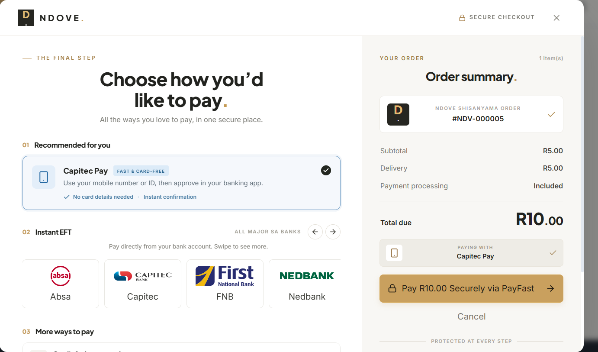

# Hi, I'm Tsetselelo Masangu 👋

**Full-stack developer** — I build real, end-to-end systems with **Java / Spring Boot**, **React / TypeScript** and **PostgreSQL**,
from database design and payments to deployment.

---

## 🔥 Featured project — Ndove Shisanyama Ordering Platform

A production-ready food ordering platform built for a real South African shisanyama (braai restaurant) serving a university campus.

- 💳 **PayFast payments** with webhook verification, idempotent checkout and stock reservation under row locks
- 🕒 **Delivery time slots** inside trading hours, with per-slot capacity
- 🔐 **Proof of delivery** — a secret 6-digit code + QR the customer gives only on hand-over
- 🔥 **Live kitchen screen**, branded email updates, ratings and event (group) orders
- 📊 **Manager back-office** — profit after food costs, refunds, supplier deliveries, team performance, nightly cash-up email
- 🧪 43 unit tests · 🐳 Docker Compose · 🔒 JWT auth with 3 roles

**Stack:** Java 21 · Spring Boot 3 · Spring Security · React 19 · TypeScript · Tailwind CSS · PostgreSQL · Flyway · Docker

➡️ **[View the project](https://github.com/24039890/ndove-shisanyama-ordering-platform)** · 🔒 private? [Request access](https://github.com/24039890/24039890/issues/new?title=Access%20request%3A%20ndove-shisanyama-ordering-platform&body=Hi%21%20I%27d%20like%20to%20view%20the%20private%20repository%20%2A%2Andove-shisanyama-ordering-platform%2A%2A.%0A%0AName%20/%20company%3A%0AReason%3A%0A)

---

## 🧰 All projects

> 🔒 = private repository. Recruiters and collaborators are welcome to **request access** — click the link and I'll add you.

### 📱 Full-stack & mobile apps
| Project | What it is | Tech |
|---|---|---|
| [UniRide (thoyondoutaxi-app)](https://github.com/24039890/thoyondoutaxi-app) | Ride / taxi app for Thohoyandou commuters — API + mobile app | Node.js · Express · Supabase · React Native (Expo) |
| 🔒 **Thohoyandou Smart Taxi Route** · [Request access](https://github.com/24039890/24039890/issues/new?title=Access%20request%3A%20THOYONDOU-SMART-TAXI-ROUTE&body=Hi%21%20I%27d%20like%20to%20view%20the%20private%20repository%20%2A%2ATHOYONDOU-SMART-TAXI-ROUTE%2A%2A.%0A%0AName%20/%20company%3A%0AReason%3A%0A) | Smart taxi route planning for Thohoyandou | TypeScript |
| 🔒 **University Accommodation App** · [Request access](https://github.com/24039890/24039890/issues/new?title=Access%20request%3A%20UNIVERSITY-ACCOMODATION-APP-&body=Hi%21%20I%27d%20like%20to%20view%20the%20private%20repository%20%2A%2AUNIVERSITY-ACCOMODATION-APP-%2A%2A.%0A%0AName%20/%20company%3A%0AReason%3A%0A) | Solves the problem of finding student accommodation at universities | JavaScript |
| 🔒 **Water Tracing App** · [Request access](https://github.com/24039890/24039890/issues/new?title=Access%20request%3A%20WATER-TRACING-APP&body=Hi%21%20I%27d%20like%20to%20view%20the%20private%20repository%20%2A%2AWATER-TRACING-APP%2A%2A.%0A%0AName%20/%20company%3A%0AReason%3A%0A) | Remotely tracks water availability in village areas | — |
| [full-stack-project-mentored-by-FNB-](https://github.com/24039890/full-stack-project-mentored-by-FNB-) | Full-stack project built under FNB mentorship | HTML · CSS · JavaScript |
| [car-rental-app](https://github.com/24039890/car-rental-app) | Car rental management app | C / C++ · Makefile |
| [carrental](https://github.com/24039890/carrental) | Car rental system (console) | C++ |
| [my-react-app](https://github.com/24039890/my-react-app) | Practising full-stack development with React | React · JavaScript |

### 🤖 AI, data & trading
| Project | What it is | Tech |
|---|---|---|
| 🔒 **Vanhu Rhanga Innovation** · [Request access](https://github.com/24039890/24039890/issues/new?title=Access%20request%3A%20Vanhu-rhanga-innovation&body=Hi%21%20I%27d%20like%20to%20view%20the%20private%20repository%20%2A%2AVanhu-rhanga-innovation%2A%2A.%0A%0AName%20/%20company%3A%0AReason%3A%0A) | ♿ Accessibility innovation — an **AI sign-language avatar** that helps Deaf and disabled patients communicate with nurses in clinics and hospitals | Python · AI |
| [realtimeobjectdetection](https://github.com/24039890/realtimeobjectdetection) | Real-time object detection | Python · Jupyter Notebook |
| 🔒 **MT5 Institutional Multi-Strategy Engine** · [Request access](https://github.com/24039890/24039890/issues/new?title=Access%20request%3A%20MT5-INSTITUTIONAL-Multi-Strategy-Engine-CRT-AMD-Trend-FVG-&body=Hi%21%20I%27d%20like%20to%20view%20the%20private%20repository%20%2A%2AMT5-INSTITUTIONAL-Multi-Strategy-Engine-CRT-AMD-Trend-FVG-%2A%2A.%0A%0AName%20/%20company%3A%0AReason%3A%0A) | Automated MT5 trading engine combining CRT, AMD, trend and FVG strategies | Python · MetaTrader 5 |
| [trading-monitor](https://github.com/24039890/trading-monitor) | Mobile app to monitor and control an MT5 trading bot in real time | React Native · Expo · Supabase Realtime · MQL5 |

### 🌐 Websites & learning
| Project | What it is | Tech |
|---|---|---|
| [Portfolio 2025](https://github.com/24039890/UPDATEDPERFOLIO-2025) | My updated personal portfolio website | HTML · CSS |
| [Portfolio website](https://github.com/24039890/PERFOLIO-WEBSITE) | My first portfolio website | HTML · CSS |
| [driving-school-website](https://github.com/24039890/driving-school-website) | Website for a driving school | HTML · CSS |
| [fullstack-developer-roadmap](https://github.com/24039890/fullstack-developer-roadmap) | Interactive full-stack developer roadmap | JavaScript |
| [roadmaps-AL-nobile](https://github.com/24039890/roadmaps-AL-nobile) | Learning roadmaps (AI / mobile) | TypeScript |
| [mybooks](https://github.com/24039890/mybooks) | Book collection project | — |

<b>💻 Programming fundamentals (C++)</b> — 7 small exercises

| Project | What it is | Tech |
|---|---|---|
| [selectionsort](https://github.com/24039890/selectionsort) | Selection sort algorithm | C++ |
| [parrallearrays](https://github.com/24039890/parrallearrays) | Parallel arrays | C++ |
| [pointer](https://github.com/24039890/pointer) | Pointers | C++ |
| [refeerencingparameter](https://github.com/24039890/refeerencingparameter) | Passing parameters by reference | C++ |
| [filehandlinf](https://github.com/24039890/filehandlinf) | File handling | C++ |
| [gradratic](https://github.com/24039890/gradratic) | Quadratic equation solver | C++ |
| [diceroll](https://github.com/24039890/diceroll) | Dice roll simulation | C++ |

---

## 🛠️ Skills

- **Backend:** Java · Spring Boot · Spring Security (JWT) · Node.js · Express · REST APIs · JPA / Hibernate · Flyway · Python · C++
- **Frontend & mobile:** React · React Native (Expo) · TypeScript · JavaScript · Tailwind CSS · HTML / CSS · PWAs
- **AI & trading:** Python · Jupyter · computer vision · sign-language AI · MetaTrader 5 / MQL5
- **Data & DevOps:** PostgreSQL · Supabase · MySQL · Docker · Docker Compose · nginx · Git / GitHub
- **Integrations:** PayFast payments · transactional email (SMTP) · webhooks

---

📫 Open to graduate, internship and junior developer opportunities — let's connect on **[LinkedIn](https://www.linkedin.com/in/tsetselelo-masangu-0508b8320/)**.

